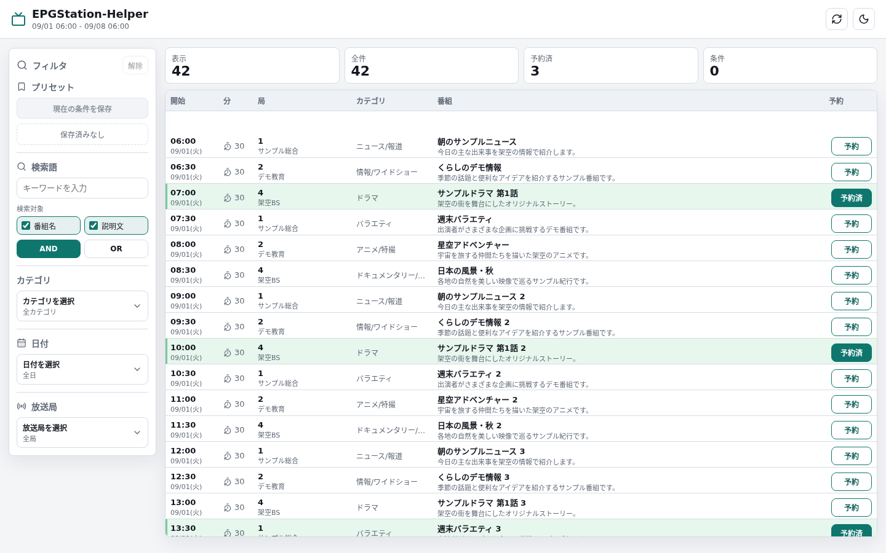
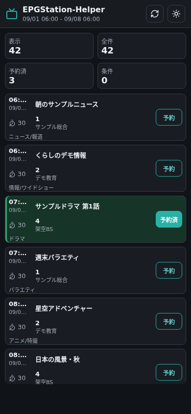

# EPGStation-Helper

EPGStationと連携し、番組の確認と手動録画予約を高密度なWeb UIで行うためのLAN内向けアプリです。

> [!WARNING]
> このアプリには認証機能がありません。インターネットへ直接公開せず、信頼できるLAN内またはアクセス制御された環境でのみ使用してください。

## 機能

- 最大7日分の番組をPC・スマートフォン向けUIで一覧表示
- カテゴリ、日付、放送局による絞り込み
- 番組名、説明文、または両方を対象にした部分一致検索
- 番組単位の録画予約と予約削除
- フィルタプリセット、通常モード、ダークモード

## スクリーンショット

表示されている番組情報、放送局、日時はすべて架空のサンプルです。

### PC



### スマートフォン



## 必要環境

- Node.js 20.19.x、または22.12.0以降
- npm
- EPGStation（バージョン2.10.0で動作確認済み）

このプロジェクトは[EPGStation](https://github.com/l3tnun/EPGStation)本体とは独立した非公式プロジェクトです。

## セットアップ

```bash
git clone https://github.com/nanotech17/epgstation-helper.git
cd epgstation-helper
npm ci
cp .env.example .env
```

`.env`の`EPGSTATION_BASE_URL`を、利用環境のEPGStation APIへ接続できるURLに設定します。

```env
EPGSTATION_BASE_URL=http://127.0.0.1:8888
HOST=127.0.0.1
PORT=3000
PROGRAM_DAYS=7
```

| 変数 | 必須 | 既定値 | 説明 |
| --- | --- | --- | --- |
| `EPGSTATION_BASE_URL` | はい | なし | EPGStationのベースURL |
| `HOST` | いいえ | `127.0.0.1` | Webサーバーの待ち受けアドレス |
| `PORT` | いいえ | `3000` | Webサーバーのポート番号 |
| `PROGRAM_DAYS` | いいえ | `7` | 取得日数（1～7） |

`EPGSTATION_BASE_URL`が未設定または不正な場合、アプリは起動しません。

## 使い方

1. ブラウザで`http://127.0.0.1:3000`、または設定したホストとポートを開きます。
2. カテゴリ、日付、放送局、検索語で番組を絞り込みます。
3. 検索対象は番組名、説明文、または両方から選択できます。
4. 番組行の「予約」で録画予約し、「予約済」で予約を削除します。

予約と予約削除は確認ダイアログを挟まず、EPGStationへ即時反映されます。

## データ保存

- 番組情報と予約情報はEPGStationから取得し、サーバー側には永続保存しません。
- フィルタプリセットとテーマはブラウザの`localStorage`へ保存します。
- 録画予約の変更はEPGStation側へ保存されます。

## 制約事項

- 取得期間は最大7日です。
- 操作対象は番組単位の予約です。ルール予約を作成・編集する機能はありません。
- EPGStation 2.10.0で動作確認しています。他のバージョンではAPI仕様の差異により動作しない可能性があります。
- 認証機能を持たない、個人利用を前提とした初期バージョンです。

## 開発

```bash
npm run dev
```

既定では`http://127.0.0.1:3000`で起動します。

## 本番ビルド

```bash
npm run check
npm start
```

`npm run check`は自動テストを実行してから、本番用ファイルを`dist`へ生成します。

## LAN内の別端末から利用する場合

`.env`で`HOST=0.0.0.0`を指定し、OSのファイアウォールなどで信頼できるLANからの接続だけを許可してください。その後、`http://<server-host>:3000`へアクセスします。

インターネットからのアクセスが必要な場合は、このアプリを直接公開せず、認証とHTTPSを提供するリバースプロキシやVPNを使用してください。

## 更新

```bash
git pull
npm ci
npm run check
```

systemdやプロセスマネージャーで運用している場合は、ビルド成功後にサービスを再起動してください。

## トラブルシューティング

- 起動時に環境変数のエラーが出る場合は、`.env`と`EPGSTATION_BASE_URL`を確認してください。
- `http://127.0.0.1:3000/api/health`へアクセスすると、EPGStationとの接続状態を確認できます。
- EPGStation側の`http://<epgstation-host>:8888/api-docs/?url=/api/docs`でAPIが利用できることを確認してください。
- インストールやビルドに失敗する場合は、Node.jsのバージョンを確認してから`npm ci`を再実行してください。

## ライセンス

[MIT License](LICENSE)
